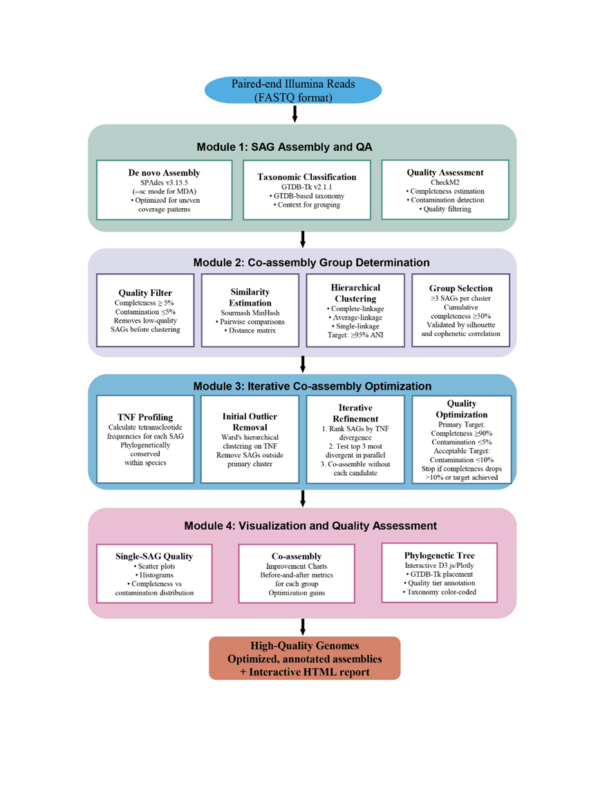

# CoSAG-nf: A Scalable Nextflow Pipeline for Co-assembly, Optimization, and Interactive Visualization of High-Throughput Single-Cell Genomes

[](https://www.nextflow.io/)
[](https://sylabs.io/docs/)
[](LICENSE)

## 📋 Overview

CoSAG-nf is a scalable Nextflow pipeline designed for processing high-throughput single-cell amplified genomes (SAGs). The pipeline performs individual assembly, similarity analysis, hierarchical clustering, co-assembly optimization, and taxonomic classification to generate high-quality metagenome-assembled genomes (MAGs) from single-cell data.



> **🔒 CONTAINER POLICY**: This pipeline requires **OFFICIAL PRE-BUILT CONTAINER IMAGES ONLY**. 
> For reproducibility and version consistency, users **MUST** download containers from the official repository. 
> Building custom containers or using alternative sources is **STRICTLY PROHIBITED** and **NOT SUPPORTED**.

### 📊 Example Output Report
**🔗 Preview the Results**: [Interactive HTML Report](http://www.biostatistics.online/CoSAG/example_report.html)

This comprehensive example report demonstrates the full analysis results you can expect from the CoSAG-nf pipeline, including:
- Assembly quality statistics and metrics
- Interactive clustering dendrograms and heatmaps  
- Taxonomic classification results with phylogenetic context
- Co-assembly optimization outcomes
- Integrated visualization dashboards

### 🔬 Key Features

- **Individual Assembly**: Individual SAG assembly using SPAdes
- **Quality Assessment**: Assembly quality evaluation with CheckM2
- **Similarity Analysis**: Genome similarity calculation using Sourmash MinHash algorithm
- **Hierarchical Clustering**: Hierarchical clustering analysis based on similarity matrices
- **Co-assembly Optimization**: Co-assembly optimization for clustered SAGs
- **Taxonomic Classification**: Taxonomic annotation using GTDB-Tk
- **Results Integration**: Comprehensive reporting and visualization

## 🛠️ System Requirements

### Hardware Requirements
- **Operating System**: Linux (Ubuntu 18.04+ or CentOS 7+ recommended)
- **Memory**: Minimum 32GB RAM (128GB+ recommended)
- **Storage**: Minimum 500GB available space
- **CPU**: Minimum 8 cores (16+ cores recommended)

### Required Software
- Nextflow (≥23.04.0)
- Singularity (≥3.8.0)
- Java (≥11)

## 📦 Installation Guide

### 1. Install Java

#### Ubuntu/Debian
```bash
sudo apt update
sudo apt install openjdk-11-jdk
```

#### CentOS/RHEL
```bash
sudo yum install java-11-openjdk-devel
```

#### Verify Installation
```bash
java -version
```

### 2. Install Nextflow

```bash
# Download and install Nextflow
curl -s https://get.nextflow.io | bash

# Move to system path
sudo mv nextflow /usr/local/bin/

# Or add to user path
mkdir -p ~/bin
mv nextflow ~/bin/
echo 'export PATH=$HOME/bin:$PATH' >> ~/.bashrc
source ~/.bashrc

# Verify installation
nextflow -version
```

### 3. Install Singularity

#### Method 1: Using Package Manager (Recommended)

**Ubuntu 20.04+**
```bash
sudo apt update
sudo apt install -y software-properties-common
sudo add-apt-repository -y ppa:apptainer/ppa
sudo apt update
sudo apt install -y apptainer
```

**CentOS 8+**
```bash
sudo dnf install -y epel-release
sudo dnf install -y apptainer
```

#### Method 2: Compile from Source

```bash
# Install dependencies
sudo apt update
sudo apt install -y build-essential libssl-dev uuid-dev libgpgme11-dev \
    squashfs-tools libseccomp-dev wget pkg-config git cryptsetup

# Install Go
export VERSION=1.19.5 OS=linux ARCH=amd64
wget https://dl.google.com/go/go$VERSION.$OS-$ARCH.tar.gz
sudo tar -C /usr/local -xzvf go$VERSION.$OS-$ARCH.tar.gz
rm go$VERSION.$OS-$ARCH.tar.gz
echo 'export PATH=/usr/local/go/bin:$PATH' >> ~/.bashrc
source ~/.bashrc

# Compile and install Singularity
export VERSION=3.11.4
wget https://github.com/sylabs/singularity/releases/download/v${VERSION}/singularity-ce-${VERSION}.tar.gz
tar -xzf singularity-ce-${VERSION}.tar.gz
cd singularity-ce-${VERSION}

./mconfig
make -C builddir
sudo make -C builddir install

# Verify installation
singularity --version
```

#### Method 3: Using Conda (For non-admin users)

```bash
# Install Miniconda
wget https://repo.anaconda.com/miniconda/Miniconda3-latest-Linux-x86_64.sh
bash Miniconda3-latest-Linux-x86_64.sh

# Reload environment
source ~/.bashrc

# Install Singularity
conda install -c conda-forge singularity

# Verify installation
singularity --version
```

### 4. Configure Singularity

```bash
# Create Singularity cache directory
mkdir -p ~/.singularity/cache

# Set environment variables (optional)
echo 'export SINGULARITY_CACHEDIR=$HOME/.singularity/cache' >> ~/.bashrc
echo 'export SINGULARITY_TMPDIR=/tmp' >> ~/.bashrc
source ~/.bashrc
```

## 🚀 Quick Start

> **🚨 PREREQUISITES CHECKLIST**
> 
> Before starting, ensure you have:
> - ✅ Installed Nextflow, Singularity, and Java
> - ✅ **Downloaded ALL required container images** (see [Container Images](#-container-images) section)
> - ✅ **Configured the `sif_dir` parameter** to point to your container directory
> - ✅ Downloaded required databases (CheckM2 and GTDB-Tk)
> 
> **💡 TIP**: Preview the expected results by checking our [Example Report](http://www.biostatistics.online/CoSAG/example_report.html) before running the pipeline.
> 
> **The pipeline will NOT work without proper container setup!**

### 1. Clone the Repository

```bash
git clone https://github.com/linfengxu/CoSAG-nf.git
cd CoSAG-nf
```

### 2. Prepare Input Data

Create a sample sheet file (`samples.tsv`) with the following format:

```tsv
sampleID	forwardReads	reverseReads
SAG001	/path/to/SAG001_R1.fastq.gz	/path/to/SAG001_R2.fastq.gz
SAG002	/path/to/SAG002_R1.fastq.gz	/path/to/SAG002_R2.fastq.gz
SAG003	/path/to/SAG003_R1.fastq.gz	/path/to/SAG003_R2.fastq.gz
```

### 3. Configure the Pipeline

> **🚨 CRITICAL STEP**: Before running the pipeline, you **MUST** configure the container image directory path.

Edit the `nextflow.config` file and update the following parameters:

```groovy
params {
    // Input/Output paths
    samplesheet = '/path/to/your/samples.tsv'
    outdir = '/path/to/your/results'
    
    // ⚠️ CRITICAL: Container image directory path - MUST BE UPDATED!
    sif_dir = '/path/to/your/singularity/images'  // ← UPDATE THIS PATH!
    
    // Database paths
    checkm2.database = '/path/to/checkm2/database'
    gtdb.database = '/path/to/gtdb/database'
}
```

**Important Notes:**
- The `sif_dir` parameter **MUST** point to the directory containing all downloaded `.sif` container files
- All container images listed in the [Container Images](#-container-images) section must be present in this directory
- The pipeline will fail if any required container is missing or the path is incorrect

### 4. Run the Pipeline

#### Basic Run
```bash
nextflow run main.nf -profile singularity
```

#### Custom Parameters Run
```bash
nextflow run main.nf \
    -profile singularity \
    --samplesheet samples.tsv \
    --outdir results \
    --max_cpus 32 \
    --max_memory 256.GB
```

#### Background Run
```bash
nohup nextflow run main.nf -profile singularity > pipeline.log 2>&1 &
```

## 📊 Output Results

The pipeline creates the following structured directory in the specified output directory:

```
results/
├── 01_individual_assemblies/     # Individual assembly results and quality assessment
│   ├── spades/                   # SPAdes assembly results
│   └── checkm2/                  # CheckM2 quality assessment results
├── 02_similarity_analysis/       # MinHash similarity analysis results
│   ├── signatures/               # Sourmash signature files
│   └── similarity_matrices/      # Similarity matrices
├── 03_clustering_analysis/       # Hierarchical clustering analysis results
│   ├── distance_matrices/        # Distance matrices
│   ├── clusters/                 # Clustering results
│   └── dendrograms/              # Phylogenetic trees
├── 04_co_assemblies/            # Co-assembly results
│   ├── cluster_*/               # Co-assembly results for each cluster
│   └── optimization_reports/    # Optimization reports
├── 05_taxonomic_classification/ # GTDB-Tk taxonomic classification results
│   ├── individual_sags/         # Individual SAG classification
│   └── co_assemblies/           # Co-assembly classification
├── 06_final_results/            # Final integrated results
│   ├── json_reports/            # JSON format reports
│   ├── html_reports/            # HTML visualization reports
└── reports/                     # Pipeline execution reports
    ├── execution_report.html    # Execution report
    ├── execution_timeline.html  # Timeline report
    └── execution_trace.txt      # Execution trace
```

### Key Output Files

- **Final Results**: `06_final_results/json_reports/final_result.json`
- **HTML Report**: `06_final_results/html_reports/embedded_report.html`

> **💡 Preview Expected Results**: See what your HTML report will look like by viewing our [Example Report](http://www.biostatistics.online/CoSAG/example_report.html) generated from test data.

## ⚙️ Parameter Configuration

### Required Parameters

| Parameter | Description | Example |
|-----------|-------------|---------|
| `--samplesheet` | Path to sample sheet file | `samples.tsv` |
| `--outdir` | Output directory path | `results/` |

### Optional Parameters

| Parameter | Default | Description |
|-----------|---------|-------------|
| `--max_cpus` | 20 | Maximum CPU cores |
| `--max_memory` | 480.GB | Maximum memory usage |
| `--max_time` | 24.h | Maximum runtime |

### Advanced Parameters

#### SPAdes Assembly Parameters
```groovy
spades {
    kmers = "21,33,55"           # K-mer sizes
    sc = true                    # Enable single-cell mode
    careful = true               # Enable careful mode
    disable_rr = true            # Disable repeat resolution
}
```

#### Sourmash Similarity Analysis Parameters
```groovy
sourmash {
    ksize = 51                   # K-mer size
    scaled = 100                 # Scaling parameter
    min_similarity_threshold = 0.05  # Minimum similarity threshold
}
```

#### Hierarchical Clustering Parameters
```groovy
hierarchical_clustering {
    linkage_method = "complete"  # Linkage method
    distance_metric = "euclidean" # Distance metric
    threshold = 0.95             # Clustering threshold
}
```

## 🐳 Container Images

> **⚠️ CRITICAL REQUIREMENT**: All required Singularity container images must be downloaded before running the pipeline. The `sif_dir` parameter in the configuration file is **ESSENTIAL** and must point to the directory containing all container images.

### Required Container Images

The pipeline uses the following Singularity container images:

| Tool | Container Image | Version | Size |
|------|-----------------|---------|------|
| SPAdes | `spades_3.15.5.sif` | 3.15.5 | ~2.5GB |
| CheckM2 | `checkm2_1.0.2.sif` | 1.0.2 | ~1.8GB |
| Sourmash | `sourmash_4.9.2--hdfd78af_0.sif` | 4.9.2 | ~800MB |
| GTDB-Tk | `gtdbtk_with_ps.sif` | 2.3.2 | ~3.2GB |
| Python | `python3.8_v1_Bio_0813.sif` | 3.8 | ~1.5GB |

### 📥 Download Pre-built Container Images

> **🚨 MANDATORY REQUIREMENT**: You **MUST** use the officially provided pre-built container images. 
> **DO NOT** attempt to build containers from Docker Hub or other sources, as this may lead to:
> - Version incompatibilities
> - Reproducibility issues  
> - Pipeline failures
> - Inconsistent results

**Download Official Container Images (REQUIRED)**

```bash
# Create directory for container images
mkdir -p /path/to/singularity/images
cd /path/to/singularity/images

# Download all required container images from official repository
# ⚠️ IMPORTANT: Use ONLY these official download links for reproducibility
wget [OFFICIAL_DOWNLOAD_URL]/spades_3.15.5.sif
wget [OFFICIAL_DOWNLOAD_URL]/checkm2_1.0.2.sif
wget [OFFICIAL_DOWNLOAD_URL]/sourmash_4.9.2--hdfd78af_0.sif
wget [OFFICIAL_DOWNLOAD_URL]/gtdbtk_with_ps.sif
wget [OFFICIAL_DOWNLOAD_URL]/python3.8_v1_Bio_0813.sif

# Verify all images are downloaded successfully
ls -lh *.sif

# Check file integrity (optional but recommended)
md5sum *.sif > container_checksums.md5
```

**Alternative Download Methods**

If `wget` is not available, you can use:

```bash
# Using curl
curl -O [OFFICIAL_DOWNLOAD_URL]/spades_3.15.5.sif
curl -O [OFFICIAL_DOWNLOAD_URL]/checkm2_1.0.2.sif
curl -O [OFFICIAL_DOWNLOAD_URL]/sourmash_4.9.2--hdfd78af_0.sif
curl -O [OFFICIAL_DOWNLOAD_URL]/gtdbtk_with_ps.sif
curl -O [OFFICIAL_DOWNLOAD_URL]/python3.8_v1_Bio_0813.sif

# Or using rsync (if available)
rsync -avP [OFFICIAL_DOWNLOAD_URL]/spades_3.15.5.sif ./
rsync -avP [OFFICIAL_DOWNLOAD_URL]/checkm2_1.0.2.sif ./
rsync -avP [OFFICIAL_DOWNLOAD_URL]/sourmash_4.9.2--hdfd78af_0.sif ./
rsync -avP [OFFICIAL_DOWNLOAD_URL]/gtdbtk_with_ps.sif ./
rsync -avP [OFFICIAL_DOWNLOAD_URL]/python3.8_v1_Bio_0813.sif ./
```

### 🔧 Configure Container Path

After downloading all container images, **CRITICALLY IMPORTANT**: Update the `sif_dir` parameter in your `nextflow.config` file:

```groovy
params {
    // ⚠️ CRITICAL: Update this path to your container images directory
    sif_dir = '/path/to/singularity/images'  // ← CHANGE THIS PATH!
    
    // Other parameters...
    samplesheet = '/path/to/your/samples.tsv'
    outdir = '/path/to/your/results'
}
```

### ✅ Verify Container Setup

Before running the pipeline, verify that all containers are accessible:

```bash
# Check if all required containers exist
CONTAINER_DIR="/path/to/singularity/images"
for container in spades_3.15.5.sif checkm2_1.0.2.sif sourmash_4.9.2--hdfd78af_0.sif gtdbtk_with_ps.sif python3.8_v1_Bio_0813.sif; do
    if [ -f "$CONTAINER_DIR/$container" ]; then
        echo "✅ Found: $container"
    else
        echo "❌ Missing: $container"
    fi
done

# Test container functionality (using official containers only)
singularity exec $CONTAINER_DIR/spades_3.15.5.sif spades.py --version
singularity exec $CONTAINER_DIR/checkm2_1.0.2.sif checkm2 --version

# If any container fails, re-download from official repository
# DO NOT attempt to build or use alternative containers
```

### ⚠️ Important Notice About Container Usage

**DO NOT BUILD CUSTOM CONTAINERS**

> **🚫 STRICTLY PROHIBITED**: Building custom containers or using alternative container sources is **NOT SUPPORTED** and **NOT RECOMMENDED** for the following reasons:
> 
> - **Version Control**: Official containers are tested with specific software versions
> - **Reproducibility**: Results may vary with different container builds
> - **Compatibility**: Custom builds may have missing dependencies or configuration issues
> - **Support**: Technical support is only provided for official containers
> 
> **✅ ONLY USE**: Pre-built containers from the official download repository

If you encounter issues with the official containers, please:
1. Verify you downloaded from the correct official URL
2. Check file integrity with checksums
3. Report issues through official support channels
4. **Do not attempt to build alternative containers**

## 🗄️ Database Configuration

### CheckM2 Database

```bash
# Download CheckM2 database
wget https://zenodo.org/record/5571251/files/checkm2_database.tar.gz
tar -xzf checkm2_database.tar.gz

# Update the path in configuration file
checkm2.database = "/path/to/checkm2_database/uniref100.KO.1.dmnd"
```

### GTDB-Tk Database

```bash
# Download GTDB-Tk database (~110GB)
wget https://data.gtdb.ecogenomic.org/releases/release220/220.0/auxillary_files/gtdbtk_package/full_package/gtdbtk_r220_data.tar.gz
tar -xzf gtdbtk_r220_data.tar.gz

# Update the path in configuration file
gtdb.database = "/path/to/gtdbtk_r220_data"
```

## 🔧 Troubleshooting

### Common Issues

#### 1. Nextflow Version Incompatibility
```bash
# Check Nextflow version
nextflow -version

# Update to latest version
nextflow self-update
```

#### 2. Singularity Permission Issues
```bash
# Check Singularity configuration
singularity config global

# Set user namespaces (if needed)
echo 'user.max_user_namespaces = 15000' | sudo tee -a /etc/sysctl.conf
sudo sysctl -p
```

#### 3. Out of Memory Errors
```bash
# Reduce parallel tasks
nextflow run main.nf -profile singularity --max_cpus 8 --max_memory 64.GB
```

#### 4. Container-Related Issues

**Missing Container Images**
```bash
# Check if all containers exist in sif_dir
ls -la /path/to/your/singularity/images/*.sif

# If containers are missing, download them from official repository ONLY
# ⚠️ DO NOT use Docker Hub or build containers manually
# Go to Container Images section and download from official links
cd /path/to/your/singularity/images
wget [OFFICIAL_DOWNLOAD_URL]/[missing_container].sif
```

**Incorrect sif_dir Path**
```bash
# Verify the sif_dir path in nextflow.config matches your actual container directory
grep "sif_dir" nextflow.config

# Update the path if necessary
sed -i 's|sif_dir = .*|sif_dir = "/correct/path/to/containers"|' nextflow.config
```

### Log Analysis

#### View Pipeline Logs
```bash
# View main log
tail -f .nextflow.log

# View specific task logs
ls work/*/
cat work/[task_hash]/.command.log
```

#### Debug Mode Execution
```bash
nextflow run main.nf -profile singularity -with-trace -with-report -with-timeline
```

## 📈 Performance Optimization


### Optimization Tips

1. **Parallelization Settings**
   ```groovy
   process.executor = 'local'
   executor.cpus = 32
   executor.memory = '256 GB'
   ```

2. **Temporary Directory Configuration**
   ```bash
   export NXF_TEMP=/fast/tmp/directory
   export SINGULARITY_TMPDIR=/fast/tmp/directory
   ```

3. **Cache Optimization**
   ```bash
   # Enable Nextflow cache
   nextflow run main.nf -profile singularity -resume
   
   # Set Singularity cache
   export SINGULARITY_CACHEDIR=/path/to/cache
   ```

## 🤝 Contributing

We welcome community contributions! Please follow these steps:

1. Fork the project repository
2. Create a feature branch (`git checkout -b feature/AmazingFeature`)
3. Commit your changes (`git commit -m 'Add some AmazingFeature'`)
4. Push to the branch (`git push origin feature/AmazingFeature`)
5. Create a Pull Request

### Development Environment Setup

```bash
# Clone development version
git clone https://github.com/linfengxu/CoSAG-nf.git
cd CoSAG-nf
```

## 📄 License

This project is licensed under the MIT License - see the [LICENSE](LICENSE) file for details.

## 📞 Support and Contact

- **Documentation**: [https://github.com/linfengxu/CoSAG-nf](https://github.com/linfengxu/CoSAG-nf)
- **Email**: quanzx@fudan.edu.cn


## 🔄 Changelog

### v1.0.0 (2025-11-05)
- Initial release
- Support for SPAdes individual assembly
- Integrated CheckM2 quality assessment
- Implemented Sourmash similarity analysis
- Added hierarchical clustering functionality
- Support for co-assembly optimization
- Integrated GTDB-Tk taxonomic classification
- Generated comprehensive HTML reports

---