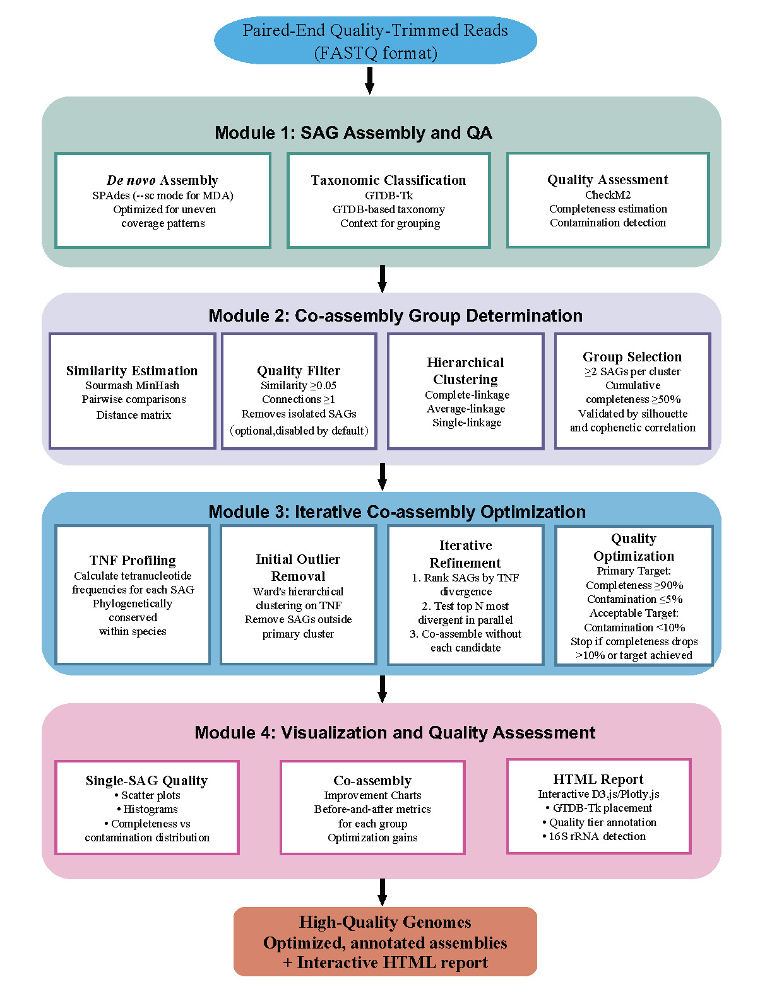
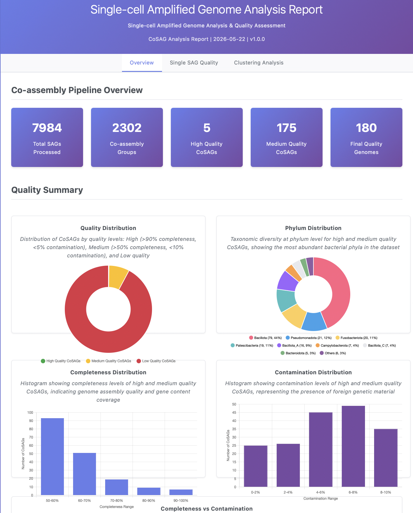

# CoSAG-nf: A Scalable Nextflow Pipeline for Co-assembly, Optimization, and Interactive Visualization of High-Throughput Single-Cell Genomes

[](https://github.com/linfengxu/CoSAG-nf/actions/workflows/ci.yml)
[](https://github.com/linfengxu/CoSAG-nf/actions/workflows/linting.yml)
[](https://www.nextflow.io/)
[](https://sylabs.io/docs/)
[](LICENSE)
[](containers/)
[](https://www.nf-test.com)

## Overview

**CoSAG-nf** (`linfengxu/CoSAG-nf`) is a scalable [Nextflow](https://www.nextflow.io/) pipeline for processing high-throughput single-cell amplified genomes (SAGs). It performs individual assembly, MinHash similarity analysis, hierarchical clustering, iterative co-assembly, TNF-based SAG subset optimization, GTDB-Tk taxonomic classification, and generates an interactive HTML report for exploring high-quality co-assembled SAG (CoSAG) genomes.



> **Containers**: Custom images on Quay.io plus Biocontainers for heavy tools — see [Container images](#container-images). Use `-profile docker` or `-profile singularity` on HPC.

### Example output report

**Preview the results**: [Interactive HTML report](http://www.biostatistics.online/CoSAG/example_report.html)

The example report demonstrates assembly quality metrics, clustering summaries, taxonomic classification, co-assembly optimization outcomes, and integrated dashboards.



### Key features

- **Individual assembly**: SPAdes assembly of each SAG in single-cell mode
- **Quality assessment**: CheckM2 completeness/contamination scoring and contamination filtering
- **Similarity analysis**: Sourmash MinHash sketching and pairwise similarity matrices
- **Hierarchical clustering**: Clustering of related SAGs for co-assembly
- **Co-assembly**: Merged-read SPAdes co-assembly per cluster, with optional multi-round refinement (`--cosag_rounds`)
- **TNF optimization**: Subset selection to improve co-assembly quality for high-completeness, high-contamination clusters
- **Taxonomic classification**: GTDB-Tk on individual SAGs and final CoSAGs
- **Interactive reporting**: Standalone `cosag_report.html` with embedded cluster JSON

### Pipeline workflow

1. **SAG assembly** — SPAdes → CheckM2 → filter → GTDB-Tk (individual SAGs)
2. **MinHash clustering** — Sourmash sketch/compare → hierarchical clustering → `round1_clusters.json`
3. **Co-assembly** — merge reads → SPAdes co-assembly → CheckM2 → TNF optimization
4. **Quality & taxonomy** — extract CoSAG contigs → barrnap → GTDB-Tk → merge into `cluster_data_gtdbtk.json`
5. **Report** — generate `cosag_report.html`

When `--round 2` is enabled, Round 1 completes first; a second MinHash clustering pass is run on Round 1 co-assembly contigs (cluster representatives), then co-assembly and reporting run again under `<OUTDIR>/round2/`. See [Two-round sourmash clustering](#two-round-sourmash-clustering---round).

## System requirements

### Hardware

| Resource | Minimum                          | Recommended |
| -------- | -------------------------------- | ----------- |
| OS       | Linux (Ubuntu 18.04+, CentOS 7+) | —           |
| RAM      | 32 GB                            | 128 GB+     |
| Storage  | 500 GB                           | 1 TB+       |
| CPU      | 8 cores                          | 16+ cores   |

### Software

- [Nextflow](https://www.nextflow.io/) (≥ 24.04.2)
- [Singularity](https://sylabs.io/docs/) or Apptainer (≥ 3.8.0)
- Java (≥ 11)

## Installation

### HPC / shared clusters

On most HPC systems, load the required modules provided by your site (names vary):

```bash
module load java/11
module load nextflow
module load singularity   # or apptainer
```

Check with your cluster documentation if you are unsure which modules to use.

### Conda / Mamba (no sudo required)

For workstations or environments without admin access, install dependencies into a user environment:

```bash
# Install Miniconda or Mambaforge if needed: https://docs.conda.io/en/latest/miniconda.html

mamba create -n cosag-nf -c conda-forge -c bioconda \
    openjdk=11 nextflow singularity

conda activate cosag-nf
nextflow -version
java -version
singularity --version
```

Alternatively, install only Nextflow via conda and use Apptainer/Singularity from your cluster modules:

```bash
mamba create -n cosag-nf -c bioconda nextflow
conda activate cosag-nf
```

### Manual system installation

If you have administrator access or prefer a system-wide install, follow the official guides:

| Dependency                        | Documentation                                                                                                                      |
| --------------------------------- | ---------------------------------------------------------------------------------------------------------------------------------- |
| Java (≥ 11)                       | [OpenJDK install](https://openjdk.org/install/)                                                                                    |
| Nextflow (≥ 24.04.2)              | [Nextflow installation](https://www.nextflow.io/docs/latest/install.html)                                                          |
| Singularity / Apptainer (≥ 3.8.0) | [Apptainer admin install](https://apptainer.org/docs/admin/main/installation.html) · [SingularityCE docs](https://docs.sylabs.io/) |

### Clone the repository

```bash
git clone https://github.com/linfengxu/CoSAG-nf.git
cd CoSAG-nf
```

Or let Nextflow download the pipeline from GitHub (cached under `~/.nextflow/assets/`):

```bash
nextflow pull linfengxu/CoSAG-nf
# equivalent: nextflow pull https://github.com/linfengxu/CoSAG-nf
```

> GitHub treats `linfengxu/cosag-nf` and `linfengxu/CoSAG-nf` as the same repo; the canonical name on GitHub is **CoSAG-nf**.

## Quick start

> **Prerequisites**
>
> - Nextflow, Singularity, and Java installed
> - Container images available (pull from Quay/Biocontainers; see [Container images](#container-images))
> - CheckM2 and GTDB-Tk databases available
> - **Preprocessed paired-end FASTQs** (see [Input data](#input-data) below)
> - Preview expected output: [example report](http://119.3.70.71/CoSAG/cosag_report_saliva.html)

### Input data

CoSAG-nf requires **paired-end short-read FASTQ** (developed and validated on Illumina; other comparable PE platforms such as MGI or Element may work but are not benchmarked here); **long-read** (PacBio, Oxford Nanopore) and **single-end** reads are not currently supported.

CoSAG-nf does **not** perform raw-read QC or host decontamination. Prepare reads upstream, then list the cleaned FASTQs in your samplesheet:

| Step | Recommended tools |
| ---- | ----------------- |
| Quality control (adapter/quality trimming) | [fastp](https://github.com/OpenGene/fastp), [Trimmomatic](http://www.usadellab.org/cms/?page=trimmomatic) |
| Host read removal | [Bowtie2](http://bowtie-bio.sourceforge.net/bowtie2/), [KneadData](https://huttenhower.sph.harvard.edu/kneaddata/) |

More detail: [`docs/usage.md`](docs/usage.md#input-data-prerequisites).

### 1. Prepare the samplesheet

Create a tab- or comma-separated file with columns `sampleID`, `forwardReads`, and `reverseReads`:

```tsv
sampleID	forwardReads	reverseReads
SAG001	/path/to/SAG001_R1.fastq.gz	/path/to/SAG001_R2.fastq.gz
SAG002	/path/to/SAG002_R1.fastq.gz	/path/to/SAG002_R2.fastq.gz
```

The same `sampleID` can appear on multiple rows if the sample was sequenced in multiple lanes; reads will be concatenated automatically.

See [`assets/samplesheet.csv`](assets/samplesheet.csv) for an example.

### 2. Configure databases and paths

Set required paths via the command line or a params file. At minimum you need:

```groovy
params {
    input       = '/path/to/samples.tsv'
    outdir      = '/path/to/results'

    checkm2_db  = '/path/to/checkm2_database/uniref100.KO.1.dmnd'
    gtdb_database = '/path/to/gtdbtk_r220_data'

}
```

Pull images (or build from [`containers/`](containers/) if needed), then run with `-profile docker` or `-profile singularity` (see [Container images](#container-images)).

### 3. Run the pipeline

**Basic run (Singularity)**

```bash
nextflow run linfengxu/CoSAG-nf \
    -profile singularity \
    --input samples.tsv \
    --outdir results \
    --checkm2_db /path/to/checkm2_database/uniref100.KO.1.dmnd \
    --gtdb_database /path/to/gtdbtk_r220_data
```

**From a local clone**

```bash
nextflow run main.nf -profile singularity --input samples.tsv --outdir results
```

**Two-round sourmash clustering** (Round 1 + second pass on co-assembly contigs → `results/round2/`)

```bash
nextflow run linfengxu/CoSAG-nf -profile singularity \
    --input samples.tsv --outdir results --round 2 --sourmash_ksize 31
```

**Background run**

```bash
nohup nextflow run linfengxu/CoSAG-nf -profile singularity \
    --input samples.tsv --outdir results -resume > pipeline.log 2>&1 &
```

> Use `-params-file params.yaml` for repeated runs. Do not pass pipeline parameters via `-c` custom config files.

Parameter documentation: [`docs/README.md`](docs/README.md) (overview), [`nextflow_schema.json`](nextflow_schema.json) (full list), [`assets/params.example.yaml`](assets/params.example.yaml) (example `-params-file`).

## Output results

The pipeline writes a numbered directory structure under `--outdir`:

```
results/
├── 01_individual_assemblies/     # Per-SAG SPAdes contigs and CheckM2
├── 02_similarity_analysis/       # Sourmash signatures and similarity matrix
├── 03_clustering_analysis/       # Clustering results and round1_clusters.json
├── 04_co_assemblies/             # Co-assembly, TNF optimization, selected CoSAG FASTAs
├── 05_taxonomic_classification/  # GTDB-Tk results (SAGs and CoSAGs)
├── 06_final_results/             # cluster_data_gtdbtk.json and cosag_report.html
├── 07_logs_and_diagnostics/      # Filtering and CheckM2 logs
├── pipeline_info/                # Nextflow execution reports
└── round2/                       # Present when --round 2
```

### Key output files

| File                                                              | Description                                                                  |
| ----------------------------------------------------------------- | ---------------------------------------------------------------------------- |
| `06_final_results/cluster_json/cluster_data_gtdbtk.json`          | Primary deliverable: integrated cluster metadata, QC, taxonomy, HQ MAG flags |
| `06_final_results/cluster_json/cluster_data_tnf.json`             | Cluster JSON with TNF optimization results                                   |
| `06_final_results/report/cosag_report.html`                       | Interactive HTML report (open in a browser)                                  |
| `03_clustering_analysis/cluster_json/round1/round1_clusters.json` | Initial cluster definitions                                                  |
| `04_co_assemblies/cluster_json/round1/updated_clusters.json`      | Post co-assembly cluster JSON                                                |

Detailed output documentation: [`docs/output.md`](docs/output.md).

## Parameter configuration

### Required parameters

| Parameter         | Description                | Example                   |
| ----------------- | -------------------------- | ------------------------- |
| `--input`         | Samplesheet path (TSV/CSV) | `samples.tsv`             |
| `--outdir`        | Output directory           | `results/`                |
| `--checkm2_db`    | CheckM2 database (`.dmnd`) | `/db/uniref100.KO.1.dmnd` |
| `--gtdb_database` | GTDB-Tk data directory     | `/db/gtdbtk_r220_data`    |

### Commonly used optional parameters

| Parameter             | Default  | Description                                                                                                             |
| --------------------- | -------- | ----------------------------------------------------------------------------------------------------------------------- |
| `--round`             | `1`      | `2` = second sourmash pass on Round 1 co-assembly contigs; outputs under `round2/`                                      |
| `--sourmash_ksize`    | `51`     | MinHash k-mer size; try `31` for SAG-level clustering (see [two-round section](#two-round-sourmash-clustering---round)) |
| `--cosag_optimize`    | `true`   | Enable TNF-based SAG subset optimization                                                                                |
| `--min_completeness`  | `50`     | Minimum completeness for CoSAG selection (%)                                                                            |
| `--max_contamination` | `10`     | Maximum contamination for CoSAG selection (%)                                                                           |
| `--max_cpus`          | `20`     | Maximum CPU cores                                                                                                       |
| `--max_memory`        | `480.GB` | Maximum memory                                                                                                          |
| `--max_time`          | `24.h`   | Maximum runtime per process                                                                                             |

### Assembly and clustering

```groovy
// SPAdes
--spades_kmers "21,33,55"
--spades_sc true
--spades_careful true

// Sourmash
--sourmash_ksize 51
--sourmash_scaled 100
--sourmash_min_similarity 0.05

// Hierarchical clustering (SciPy; see linkage guidance below)
--cluster_linkage_method complete
--cluster_criterion inconsistent
--cluster_threshold 0.95
--cluster_min_size 2
--cluster_max_size 50
```

#### Hierarchical clustering linkage methods

After Sourmash similarity analysis, SAGs are clustered with **SciPy** hierarchical clustering (`scipy.cluster.hierarchy.linkage`). The linkage method is a **user-defined parameter** (`--cluster_linkage_method`); it does not require a separate input file beyond the computed distance matrix.

| Method               | Behaviour                                                                               | When it may be useful                                                                                      |
| -------------------- | --------------------------------------------------------------------------------------- | ---------------------------------------------------------------------------------------------------------- |
| `complete` (default) | Cluster distance = maximum distance between any pair across clusters (complete-linkage) | Conservative grouping; keeps dissimilar genomes apart — **pipeline default**                               |
| `average`            | Cluster distance = mean inter-cluster pairwise distance                                 | Moderate, less sensitive to single distant outliers than complete                                          |
| `single`             | Cluster distance = minimum inter-cluster distance                                       | Can merge chains of similar SAGs; may need a stricter `--cluster_threshold`                                |
| `ward`               | Minimizes variance increase on merge                                                    | Optional alternative; distances are derived from MinHash/Jaccard — validate results against the dendrogram |

Also tune `--cluster_criterion` (default `inconsistent`) and `--cluster_threshold` (default `0.95`) together with the linkage method. Outputs for inspection: `03_clustering_analysis/results/dendrogram.png`, `cluster_validation.txt`, and `summary/final_clustering_summary.txt`.

> This repository does not ship formal rules for choosing linkage on a given dataset. For publication or production runs, compare candidate settings (cluster count, cophenetic correlation in the validation report, and biological plausibility of co-assembly groups).

> **Note:** TNF co-assembly optimization (`cosag_optimizer.py`) performs a separate hierarchical clustering step with `ward` linkage on tetranucleotide frequencies — independent of `--cluster_linkage_method`.

### Two-round sourmash clustering (`--round`)

MinHash clustering (step 2) supports an optional **two-round** sourmash strategy to improve SAG-level cluster resolution before co-assembly and TNF optimization.

| Mode                  | Behaviour                                                                                                                                                                                                                                                                        |
| --------------------- | -------------------------------------------------------------------------------------------------------------------------------------------------------------------------------------------------------------------------------------------------------------------------------- |
| `--round 1` (default) | Single-pass MinHash clustering on all input SAG contigs.                                                                                                                                                                                                                         |
| `--round 2`           | After Round 1 finishes (assembly → clustering → co-assembly → report), runs a **second** sourmash clustering pass on **Round 1 co-assembly contigs** (one representative FASTA per cluster), then repeats co-assembly, quality/taxonomy, and reporting under `<OUTDIR>/round2/`. |

**Rationale:** Single-cell amplified genomes (SAGs) often have incomplete and uneven coverage, which weakens MinHash sketch overlap in a single pass. Re-sketching and re-clustering **cluster-level co-assembly contigs** can recover related groups that were split in Round 1 and yields more coherent boundaries before downstream TNF-based optimization.

**Distances:** The pipeline uses Jaccard similarity from Sourmash; hierarchical clustering works on **distance = 1 − similarity** (see `--distance_metric`, default `jaccard`).

**`k`-mer size:** For SAG-level clustering we recommend `--sourmash_ksize 31`; `51` (the default) was overly stringent in our oral microbiome benchmark. Tune on your data together with `--cluster_threshold`.

> **Do not confuse** `--round` with `--cosag_rounds`: `--cosag_rounds` controls **internal** co-assembly iterations within Round 1 (`round2/` / `round3/` under `04_co_assemblies/`), not the standalone second workflow under `<OUTDIR>/round2/`.

**Usage:**

```bash
nextflow run linfengxu/CoSAG-nf \
    -profile singularity \
    --input samples.tsv \
    --outdir results \
    --round 2 \
    --sourmash_ksize 31 \
    --checkm2_db /path/to/checkm2_database/uniref100.KO.1.dmnd \
    --gtdb_database /path/to/gtdbtk_r220_data
```

## Container images

CoSAG-nf uses a **mixed container strategy** (image URIs are set in each `modules/local/*/main.nf`):

| Source                                                      | Image                                                | Processes                                                   |
| ----------------------------------------------------------- | ---------------------------------------------------- | ----------------------------------------------------------- |
| [Quay.io `xulf2022`](https://quay.io/organization/xulf2022) | `quay.io/xulf2022/python3.8_bio:v1`                  | Clustering, JSON merge, filtering, HTML report (`bin/*.py`) |
| Quay.io `xulf2022`                                          | `quay.io/xulf2022/spades_checkm2:v1`                 | TNF co-assembly optimization (`COSAG_OPTIMIZATION`)         |
| [Biocontainers](https://biocontainers.pro/)                 | `spades`, `checkm2`, `sourmash`, `gtdbtk`, `barrnap` | Assembly, QC, MinHash, taxonomy, rRNA annotation            |

Pull custom images before the first run:

```bash
docker pull quay.io/xulf2022/python3.8_bio:v1
docker pull quay.io/xulf2022/spades_checkm2:v1
```

On HPC with Singularity/Apptainer, use `-profile singularity`; Nextflow pulls Biocontainers and can pull Docker images from Quay (see [`containers/README.md`](containers/README.md)).

### Rebuild custom images (optional)

Dockerfiles under [`containers/`](containers/) match the published Quay tags:

| Dockerfile                                                                     | Published tag                        |
| ------------------------------------------------------------------------------ | ------------------------------------ |
| [`containers/python-bio/Dockerfile`](containers/python-bio/Dockerfile)         | `quay.io/xulf2022/python3.8_bio:v1`  |
| [`containers/spades-checkm2/Dockerfile`](containers/spades-checkm2/Dockerfile) | `quay.io/xulf2022/spades_checkm2:v1` |

Override any process image in [`conf/modules.config`](conf/modules.config) without editing module files.

## Database configuration

### CheckM2

Download the CheckM2 reference database following the [CheckM2 documentation](https://github.com/CheckM-CheckM2/CheckM2#database-installation), then set:

```bash
--checkm2_db /path/to/checkm2_database/uniref100.KO.1.dmnd
```

### GTDB-Tk

```bash
# GTDB release 220 (~110 GB)
wget https://data.gtdb.ecogenomic.org/releases/release220/220.0/auxillary_files/gtdbtk_package/full_package/gtdbtk_r220_data.tar.gz
tar -xzf gtdbtk_r220_data.tar.gz
# Set: --gtdb_database /path/to/gtdbtk_r220_data
```

## Troubleshooting

### Nextflow version

```bash
nextflow -version
nextflow self-update
```

### Singularity permissions

```bash
echo 'user.max_user_namespaces = 15000' | sudo tee -a /etc/sysctl.conf
sudo sysctl -p
```

### Out of memory

Reduce parallelism:

```bash
nextflow run linfengxu/CoSAG-nf -profile singularity \
    --input samples.tsv --outdir results --max_cpus 8 --max_memory 64.GB
```

### Missing containers

Rebuild images from [`containers/`](containers/) or verify `container` paths in `modules/local/*/main.nf` and `conf/modules.config` match your Docker/Singularity setup.

### Logs and debugging

```bash
tail -f .nextflow.log
nextflow run linfengxu/CoSAG-nf -profile singularity -resume -with-trace -with-report -with-timeline
```

## Performance tips

1. Use `-resume` to restart from the last successful step.
2. Set fast temporary directories: `export NXF_TEMP=/fast/tmp` and `export SINGULARITY_TMPDIR=/fast/tmp`.
3. Tune `--max_cpus` and `--max_memory` to match your cluster or workstation.

## Documentation

| Document                                                   | Description                                           |
| ---------------------------------------------------------- | ----------------------------------------------------- |
| [`docs/README.md`](docs/README.md)                         | Documentation index and parameter schema guide        |
| [`docs/usage.md`](docs/usage.md)                           | How to run the pipeline and samplesheet format        |
| [`docs/output.md`](docs/output.md)                         | Output directory and file descriptions                |
| [`nextflow_schema.json`](nextflow_schema.json)             | All pipeline parameters (`description` / `help_text`) |
| [`assets/params.example.yaml`](assets/params.example.yaml) | Example `-params-file`                                |
| [`CITATIONS.md`](CITATIONS.md)                             | Tool citations                                        |

## Contributing

Contributions are welcome. Please see [`.github/CONTRIBUTING.md`](.github/CONTRIBUTING.md).

```bash
git clone https://github.com/linfengxu/CoSAG-nf.git
cd CoSAG-nf
```

## License

This project is licensed under the MIT License — see [LICENSE](LICENSE).

## Support and contact

- **GitHub**: [https://github.com/linfengxu/CoSAG-nf](https://github.com/linfengxu/CoSAG-nf)
- **Containers**: [`containers/`](containers/)
- **Email**: quanzx@fudan.edu.cn

## Credits

CoSAG-nf was originally written by Linfeng Xu.

This pipeline uses infrastructure from the [nf-core](https://nf-co.re) community. See [CITATIONS.md](CITATIONS.md) for tool references.

> **The nf-core framework for community-curated bioinformatics pipelines.**
> Philip Ewels et al. _Nat Biotechnol._ 2020. doi: [10.1038/s41587-020-0439-x](https://dx.doi.org/10.1038/s41587-020-0439-x)

## Changelog

### v1.0.0 (2025-11-05)

- Initial public release
- SPAdes individual assembly and CheckM2 QC
- Sourmash similarity analysis and hierarchical clustering
- Multi-round co-assembly with TNF optimization
- GTDB-Tk taxonomic classification
- Interactive HTML report (`cosag_report.html`)
- nf-core DSL2 pipeline structure with documented output layout
